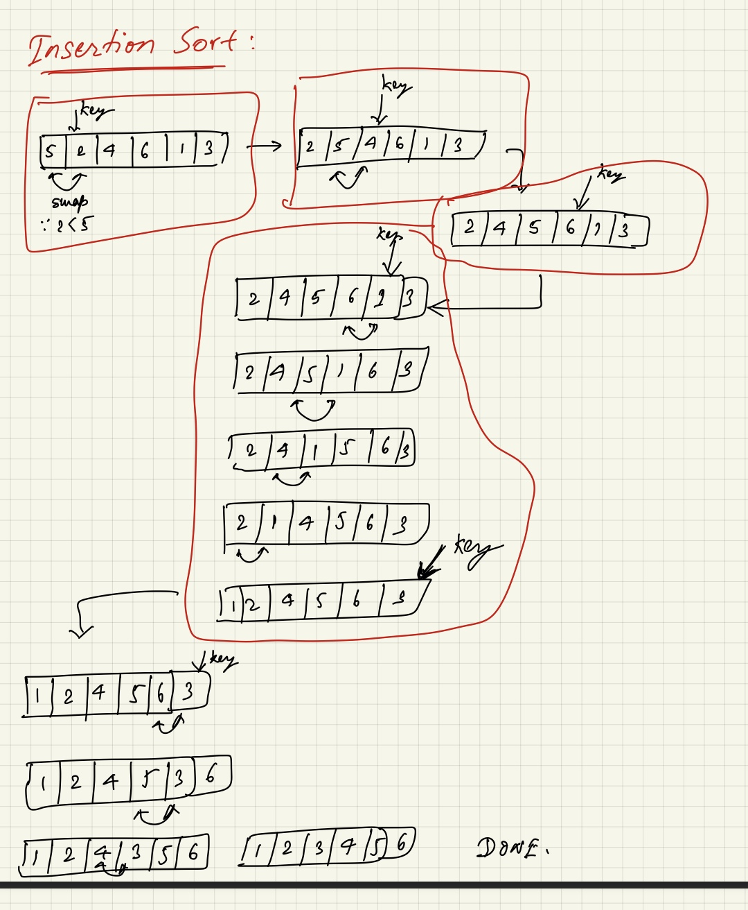

# Sorting Algorithms

## Insertion Sort

### Vanilla Insertion Sort

???+ note "Vanilla Insertion Sort"

    ```
    for i = 1, 2, 3, ..., n{
        insert A[i] into sorted array A[0:i-1]
        by "pairwise swaps" down to the correct position
    }
    ```
    

    This above version has **$\theta(n)$** steps and each step has **$\theta(n)$** comparisons. SO this version of the algorithm is **$\theta(n^2)$** runtime complexity.

### Binary Insertion Sort

???+ note "Binary Insertion Sort"
    This improved version is slightly improved by using **Binary Search** while searching for the position to place the key `A[i]` in the sorted part of the array (i.e. `A[0:i-1]`)
    ```
    for i = 1, 2, 3, ..., n{
        insert A[i] into sorted array A[0:i-1]
        by "Binary Search" down to the correct position
    }
    ```

    This above version has **$\theta(n)$** steps and each step has **$\theta(\log(n))$** comparisons due to Binary Search. SO this version of the algorithm is **$\theta(n\times \log(n))$** runtime complexity (in sorting **but not in swappings**). If we consider swapping operations too then even Binary Search will take $\theta(n)$ time to swap positions as it might have to move a lot of positions.


## References
[^1]: https://twitter.com/pottolama/status/1354745837524553728
[^2]: https://github.com/mportesi/sorting_algo_visualizer
