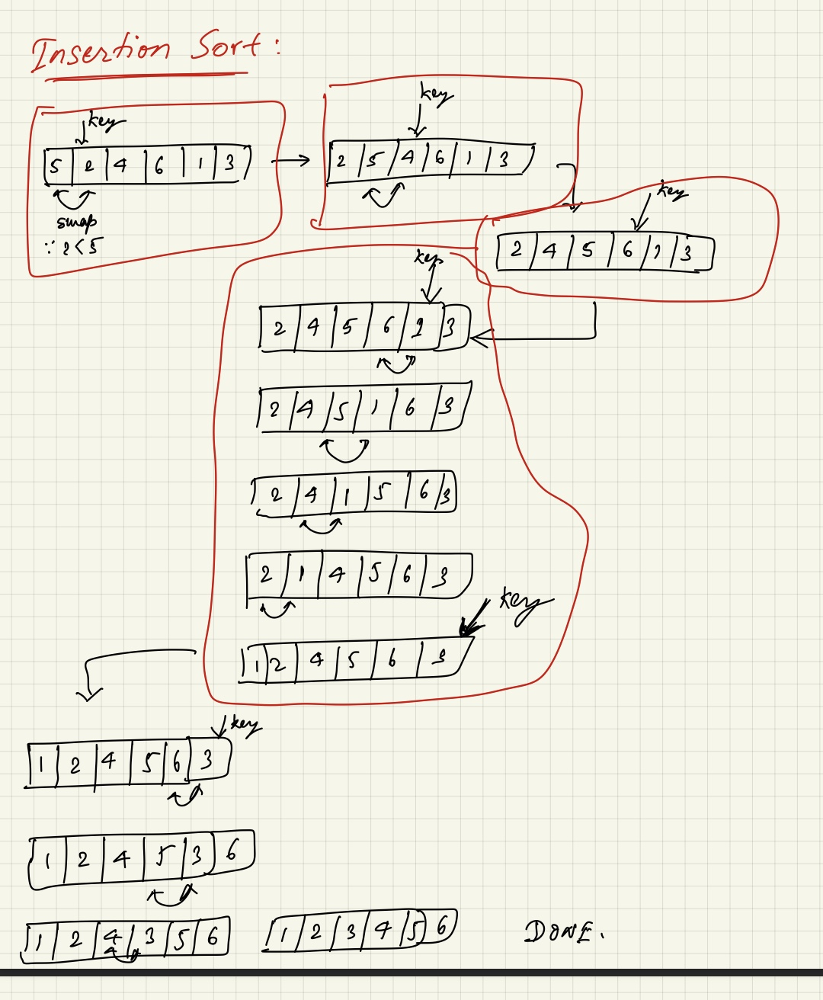

# Insertion Sort

## Definition

???+ note "Pseudo Code `#1`"

    ```
    for i = 1, 2, 3, ..., n{
        insert A[i] into sorted array A[0:i-1]
        by "pairwise swaps" down to the correct position
    }
    ```
    

    This above version has **$\theta(n)$** steps and each step has **$\theta(n)$** comparisons. SO this version of the algorithm is **$\theta(n^2)$** runtime complexity.

???+ note "Pseudo Code `#2`"
    This improved version is slightly improved by using **Binary Search** while searching for the position to place the key `A[i]` in the sorted part of the array (i.e. `A[0:i-1]`)
    ```
    for i = 1, 2, 3, ..., n{
        insert A[i] into sorted array A[0:i-1]
        by "Binary Search" down to the correct position
    }
    ```

    This above version has **$\theta(n)$** steps and each step has **$\theta(\log(n))$** comparisons due to Binary Search. SO this version of the algorithm is **$\theta(n\times \log(n))$** runtime complexity.


???+ quote "Author Disclaimer"
    `Author: Vinay Kumar (@imflash217)`

    `Date: 31/January/2021`

    The contents of this article were originally published at the references below. I have assembled it for my own understanding. Feel free to reuse and tag along the references. :+1:

## `References`
[^1]: