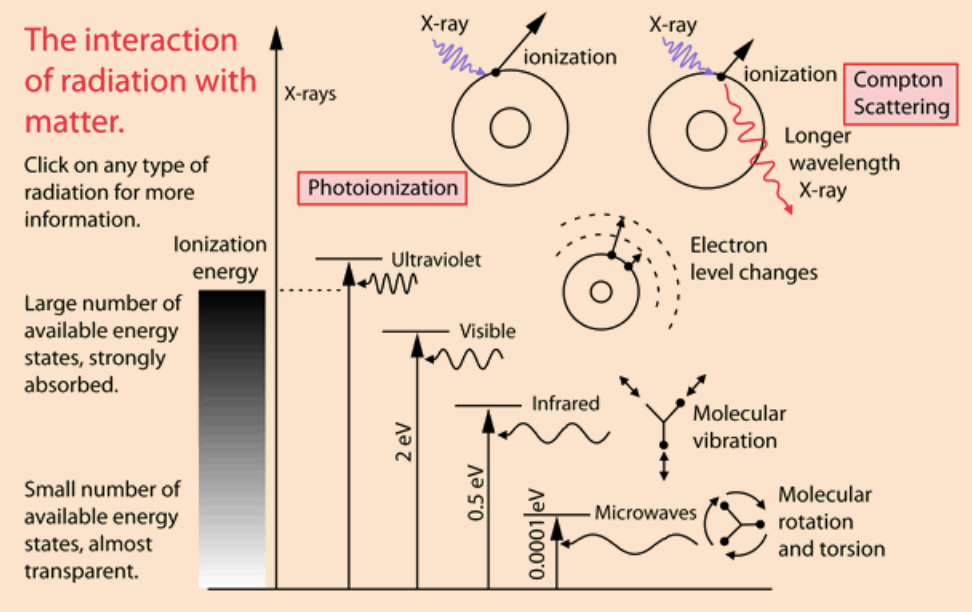
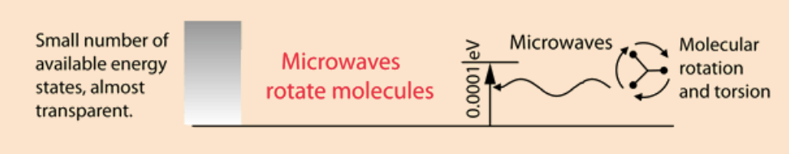
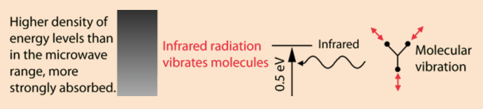
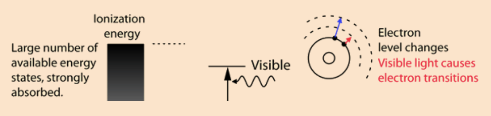
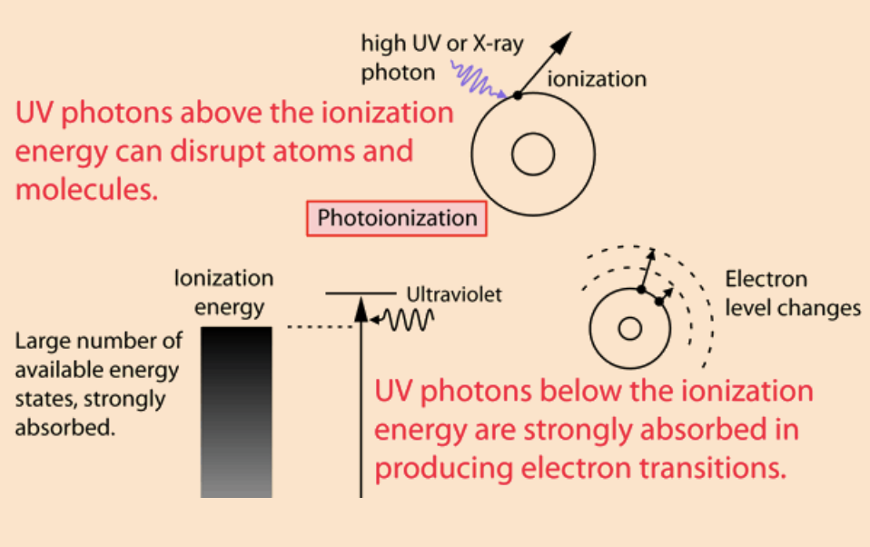
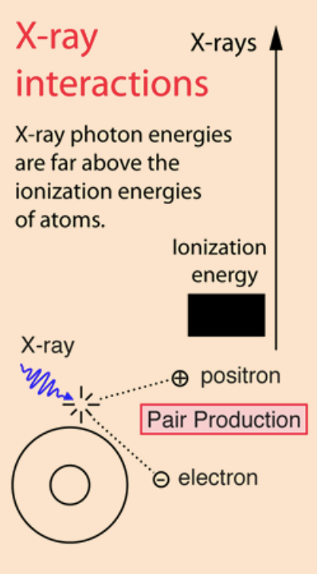
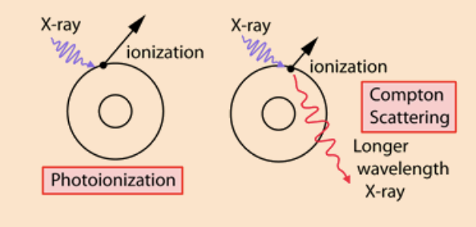

<!-- ---
hide:
  - navigation # Hide navigation
  - toc        # Hide table of contents
--- -->

# Electromagnetic Spectrum, properties of material medium & its effects.
`Written by @imflash217`

???+ quote "......."
    
    You may click on any of the types of radiation for more detail about its particular type of interaction with matter. The different parts of the electromagnetic spectrum have very different effects upon interaction with matter. Starting with low frequency radio waves, the human body is quite transparent. (You can listen to your portable radio inside your home since the waves pass freely through the walls of your house and even through the person beside you!) As you move upward through microwaves and infrared to visible light, you absorb more and more strongly. In the lower ultraviolet range, all the uv from the sun is absorbed in a thin outer layer of your skin. As you move further up into the x-ray region of the spectrum, you become transparent again, because most of the mechanisms for absorption are gone. You then absorb only a small fraction of the radiation, but that absorption involves the more violent ionization events. Each portion of the electromagnetic spectrum has quantum energies appropriate for the excitation of certain types of physical processes. The energy levels for all physical processes at the atomic and molecular levels are quantized, and if there are no available quantized energy levels with spacings which match the quantum energy of the incident radiation, then the material will be transparent to that radiation, and it will pass through. If electromagnetic energy is absorbed, but cannot eject electrons from the atoms of the material, then it is classified as non-ionizing radiation, and will typically just heat the material.

???+ quote "......."
    
    The quantum energy of microwave photons is in the range 0.00001 to 0.001 eV which is in the range of energies separating the quantum states of molecular rotation and torsion. The interaction of microwaves with matter other than metallic conductors will be to rotate molecules and produce heat as result of that molecular motion. Conductors will strongly absorb microwaves and any lower frequencies because they will cause electric currents which will heat the material. Most matter, including the human body, is largely transparent to microwaves. High intensity microwaves, as in a microwave oven where they pass back and forth through the food millions of times, will heat the material by producing molecular rotations and torsions. Since the quantum energies are a million times lower than those of x-rays, they cannot produce ionization and the characteristic types of radiation damage associated with ionizing radiation.

???+ quote "......."
    
    The quantum energy of microwave photons is in the range 0.00001 to 0.001 eV which is in the range of energies separating the quantum states of molecular rotation and torsion. The interaction of microwaves with matter other than metallic conductors will be to rotate molecules and produce heat as result of that molecular motion. Conductors will strongly absorb microwaves and any lower frequencies because they will cause electric currents which will heat the material. Most matter, including the human body, is largely transparent to microwaves. High intensity microwaves, as in a microwave oven where they pass back and forth through the food millions of times, will heat the material by producing molecular rotations and torsions. Since the quantum energies are a million times lower than those of x-rays, they cannot produce ionization and the characteristic types of radiation damage associated with ionizing radiation.

???+ quote "......."
    
    The quantum energy of microwave photons is in the range 0.00001 to 0.001 eV which is in the range of energies separating the quantum states of molecular rotation and torsion. The interaction of microwaves with matter other than metallic conductors will be to rotate molecules and produce heat as result of that molecular motion. Conductors will strongly absorb microwaves and any lower frequencies because they will cause electric currents which will heat the material. Most matter, including the human body, is largely transparent to microwaves. High intensity microwaves, as in a microwave oven where they pass back and forth through the food millions of times, will heat the material by producing molecular rotations and torsions. Since the quantum energies are a million times lower than those of x-rays, they cannot produce ionization and the characteristic types of radiation damage associated with ionizing radiation.

???+ quote "......."
    
    The quantum energy of microwave photons is in the range 0.00001 to 0.001 eV which is in the range of energies separating the quantum states of molecular rotation and torsion. The interaction of microwaves with matter other than metallic conductors will be to rotate molecules and produce heat as result of that molecular motion. Conductors will strongly absorb microwaves and any lower frequencies because they will cause electric currents which will heat the material. Most matter, including the human body, is largely transparent to microwaves. High intensity microwaves, as in a microwave oven where they pass back and forth through the food millions of times, will heat the material by producing molecular rotations and torsions. Since the quantum energies are a million times lower than those of x-rays, they cannot produce ionization and the characteristic types of radiation damage associated with ionizing radiation.

???+ quote "......."
    | First Header                                   | Second Header                                  |
    | ---------------------------------------------- | ---------------------------------------------- |
    |  |  |

    Since the quantum energies of x-ray photons are much too high to be absorbed in electron transitions between states for most atoms, they can interact with an electron only by knocking it completely out of the atom. That is, all x-rays are classified as ionizing radiation. This can occur by giving all of the energy to an electron (photoionization) or by giving part of the energy to the electron and the remainder to a lower energy photon (Compton scattering). At sufficiently high energies, the x-ray photon can create an electron positron pair.

`Author: @imflash217`
`Date: 28/January/2021`

### `References:`
[^1]: [http://hyperphysics.phy-astr.gsu.edu/hbase/mod3.html](http://hyperphysics.phy-astr.gsu.edu/hbase/mod3.html)
[^2]: [http://hyperphysics.phy-astr.gsu.edu/hbase/mod2.html](http://hyperphysics.phy-astr.gsu.edu/hbase/mod2.html)
[^3]: [https://physics.stackexchange.com/questions/300551/how-can-wifi-penetrate-through-walls-when-visible-light-cant](https://physics.stackexchange.com/questions/300551/how-can-wifi-penetrate-through-walls-when-visible-light-cant)
[^4]: [https://physics.stackexchange.com/questions/1836/why-is-air-invisible](https://physics.stackexchange.com/questions/1836/why-is-air-invisible)
[^5]: [https://physics.stackexchange.com/questions/7437/why-is-glass-transparent](https://physics.stackexchange.com/questions/7437/why-is-glass-transparent)

