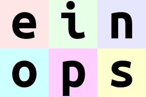
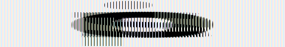

<!-- ---
hide:
  - navigation # Hide navigation
  - toc        # Hide table of contents
--- -->

## Part-1

### Welocome to `einops`

1. We don't write 
    ```python
    y = x.transpose(0,2,3,1)
    ```
2. We write comprehensible code
    ```python
    y = einops.rearrange(x, "b c h w -> b h w c")
    ```
3. `einops` supports widely used tensor packages viz. 
    `numpy`, `pytorch`, `tensorflow`, `chainer`, `gluon`
    and **extends** them.

### What's in this tutorial?

1. **Fundamentals**: reordering, composition, and decomposition of tensors.
2. **Operations**: `rearrange`, `reduce`, `repeat`
3. How much can you do with a **single** operation?

### Preparations
```python
import numpy
from utils import display_np_arrays_as_images
display_np_arrays_as_images()
```

### Load a batch of images
```python
## there are 6 images of shape 96x96
## with 3 color channels packed as tensors
images = np.load("./resources/tes_images.npy", allow_pickle=False)

print(images.shape, images.dtype)   ## (6, 96, 96, 3), float64
```

```python
## display the 1st image (whole 4d tensor can't be rendered)
images[0]
```
<figure markdown>

</figure>

```python
images[1]
```
<figure markdown>

</figure>

**We will use three opeartions:** `rearrange`, `reduce`, `repeat`
```python
from einops import rearrange, reduce, repeat
```

### Meet (`rearrange`)

???+ done "rearrange"
    As its name suggests; it rearranges elements. Below, we swap `height` and `width`.

    In other words, below we **transpose** first two axes/dimensions.
    ```python
    rearrange(images[0], "h w c -> w h c")
    ```
    <figure markdown> 
        
        <figcaption>`rearrange()`</figcaption>
    </figure>

### Composition of axes

Transposition is very common and useful; but let's move to other 
operations provided by `einops`

???+ done "composition using `rearrange()` : height"
    `einops` allows seamlessly composing `batch` and `height` to a `new height` dimension.

    Below we just rendered all images in the 4D tensor by collapsing it to a 3D tensor.
    ```python
    rearrange(images, "b h w c -> (b h) w c")
    ```
    <figure markdown> 
        
    </figure>


???+ danger "composition using `rearrange()`: width"
    `einops` allows seamlessly composing `batch` and `width` to a `new width` dimension.

    Below we just rendered all images in the 4D tensor by collapsing it to a 3D tensor.
    ```python
    rearrange(images, "b h w c -> h (b w) c")
    ```
    <figure markdown> 
        
    </figure>

Resulting dimensions are computed very simply. 
**Length of any newly computed axes/dimension is a product of its components**
```python
## [6, 96, 96, 3] -> [96, (6*96), 3]
a = rearrange(images, "b h w c -> h (b w) c")
a.shape
```
```
(96, 576, 3)
```

We can compose more than 2 axes/dimensions.
Let's **flatten** the whole 4D array into a 1D array.
The resulting 1D array contains as many elements as the original 4D array.

```python
## [6, 96, 96, 3] -> [(6*96*96*3)]
a = rearrange(images, "b h w c -> (b h w c)")
a.shape
```
```
(165888, )
```

### Decomposition of axes

**Decomposition** is the inverse process of composition. 

**It represents an existing axis as a combination of new axes**.

Several decompositions are possible. Some examples are shown below:

???+ danger "Combining _composition_ and _decomposition_"
    Combining composition & decomposition
    ```python
    ## here b1=2, decomposes b=6 into "b1=2" and "b2=3"
    ## keeping b = b1*b2
    a = rearrange(images, "(b1 b2) w h c -> b1 b2 w h c", b1=2)
    a.shape     ## (2, 3, 96, 96, 3)
    ```
    ```
    (2, 3, 96, 96, 3)
    ```

???+ done "An example"
    Combining composition & decomposition
    ```python
    ## here b1=2, decomposes b=6 into "b1=2" and "b2=3"
    ## keeping b = b1*b2
    a = rearrange(images, "(b1 b2) w h c -> (b1 h) (b2 w) c", b1=2)

    a.shape     ## (2*96, 3*96, 3)
    a
    ```
    <figure markdown>
    
    </figure>

???+ danger "Another combination"
    Combining composition & decomposition
    ```python
    ## here b1=2, decomposes b=6 into "b1=2" and "b2=3"
    ## keeping b = b1*b2
    a = rearrange(images, "(b1 b2) w h c -> (b2 h) (b1 w) c", b1=2)

    a.shape     ## (3*96, 2*96, 3)
    a
    ```
    <figure markdown>
    
    </figure>

???+ done "Another example: `width_to_height`"
    Move part of the `width` dimension to `height`

    We should call this `width_to_height` as the image `width` shrunk by 2 and `height` incresed by 2.

    **But all pixels are same!!!**

    ```python
    a = rearrange(images, "b h (w w2) c -> (h w2) (b w) c", w2=2)

    a.shape     ## (96*2, 6*48, 3)
    a
    ```
    <figure markdown>
    
    </figure>

???+ done "Another example: `heigh_to_width`"
    Move part of the `height` dimension to `width`

    We should call this `height_to_width` as the image `height` shrunk by 2 and `width` incresed by 2.

    **But all pixels are same!!!**

    ```python
    a = rearrange(images, "b (h h2) w c -> (b h) (w h2) c", h2=2)

    a.shape     ## (6*48, 96*2, 3)
    ```

### Order of axes matter

The order of axes in composition and decomposition is of prime importance. 
It affects the way data is being transposed. Below examples show the impacts.

???+ danger "An example"
    ```python
    a = rearrange(images, "b h w c -> h (b w) c")       ## notice the ordering of (b w)
    a.shape                                             ## (96, 6*96, 3)
    a
    ```
    <figure markdown>
    
    </figure>

    v/s

    ```python
    b = rearrange(images, "b h w c -> h (w b) c")       ## notice the ordeing of (w b)
    b.shape                                             ## (96, 96*6, 3)
    b
    ```
    <figure markdown>
    
    </figure>

    **Though the shapes of both `a` and `b` are same but the ordering of pixels are different.**

    **`RULE`**: The rule of importance is just as for digits. 
    The **leftmost** digit is **most significant**.
    Neighboring number differ in _rightmost_ axis.

    ------------------------------------------------------
    
    What will happen if `b1` and `b2` are _reordered_ before composing to `width` 
    (as shown in examples below):
    ```python
    rearrange(images, "(b1 b2) h w c -> h (b1 b2 w) c", b1=2)     ## produces "einops"
    rearrange(images, "(b1 b2) h w c -> h (b2 b1 w) c", b1=2)     ## prodices "eoipns"
    ```
    <figure markdown>
    
    </figure>

### Meet (`reduce`)

In `einops` we don't need to guess what happened (like below)
```python
x.mean(-1)
```
Because we write clearly what happened (as shown below)
```python
import einops.reduce

reduce(x, "b h w c -> b h w", "mean")
```
If an axis was not present in the output definition --you guessed it -- it was **reduced**

???+ done "Average over batch"
    Average over batch
    ```python
    u = reduce(images, "b h w c -> h w c", "mean")      ## reduce using "mean" across the "batch" axis
    u.shape                                             ## (96, 96, 3)
    u
    ```
    <figure markdown>
    
    </figure>

    The above code is similar to the standard code (without `einops`) as shown below
    ```python
    u = images.mean(axis=0)     ## find mean across the "batch" dimension 
    u.shape                     ## (96, 96, 3)
    u
    ```
    <figure markdown>
    
    </figure>

    But, the code with `einops` is much more readable and states the operations clearly.

???+ danger "Reducing over multiple axes"
    Example of reducing over several dimensions.
    
    Besides `"mean"`, there are also `"min"`, `"max"`, `"sum"`, `"prod"`
    ```python
    u = reduce(images, "b h w c -> h w", "min")     ## redce across "batch" & "channel" axes
    u.shape                                         ## (96, 96)
    u
    ```
    <figure markdown>
    
    </figure>

???+ done "Mean pooling with 2x2 kernel"
    Image is split into 2x2 patch and each path is avergaed
    ```python
    u = reduce(images, "b (h h2) (w w2) c -> h (b w) c", "mean", h2=2, w2=2)
    u.shape         ## (48, 6*48, 3)
    u
    ```
    <figure markdown>
    
    </figure>

???+ danger "max-pooling with 2x2 kernel"
    Image is split into 2x2 patch and each patch is max-pooled
    ```python
    u = reduce(images, "b (h h2) (w w2) c -> h (b w) c", "max", h2=2, w2=2)
    u.shape         ## (49, 6*48, 3)
    u
    ```
    <figure markdown>
    
    </figure>

???+ danger "yet another example"
    ```python
    u = reshape(images, "(b1 b2) h w c -> (b2 h) (b1 w)", "mean", b1=2)
    u.shape         ## (3*96, 2*96)
    u
    ```
    <figure markdown>
    
    </figure>
