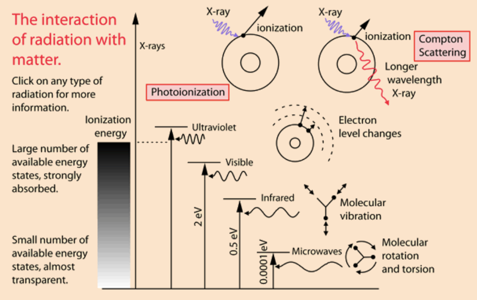
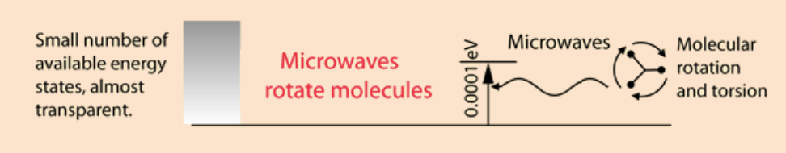
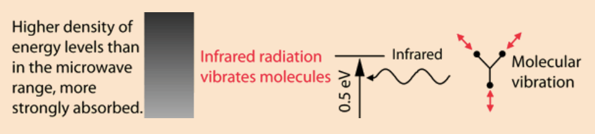
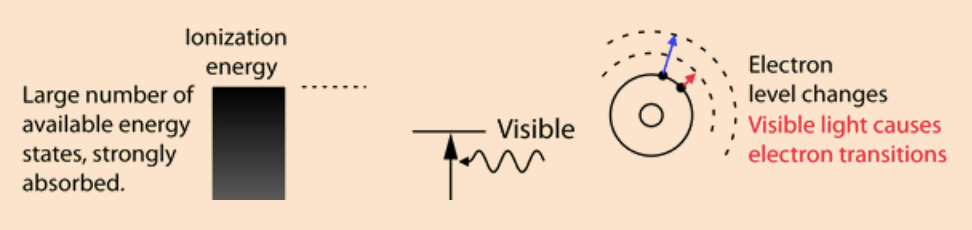
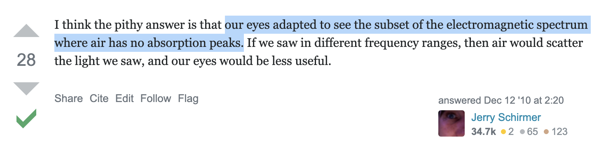
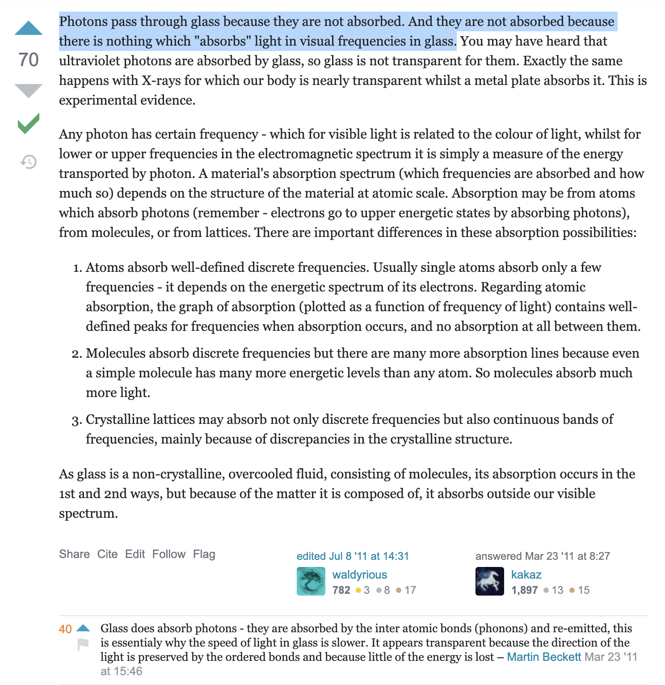
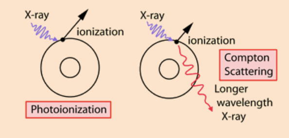

<!-- ---
hide:
  - navigation # Hide navigation
  - toc        # Hide table of contents
--- -->

# Electromagnetic Spectrum, properties of material medium & its effects.
`Author: Vinay Kumar (@imflash217) | Date: 28/January/2021`

???+ quote ""
    
    The different parts of the electromagnetic spectrum have very different effects upon interaction with matter. Starting with low frequency `radio waves`, the human body is quite transparent (_you can listen to your portable radio inside your home since the waves pass freely through the walls of your house and even through the person beside you!_) **As you move upward through `microwaves` and `infrared` to `visible light`, you absorb more and more strongly.** In the lower ultraviolet range, all the `UV` from the sun is absorbed in a thin outer layer of your skin. As you move further up into the `x-ray` region of the spectrum, you become transparent again, because most of the mechanisms for absorption are gone. You then absorb only a small fraction of the radiation, but that absorption involves the `more violent ionization events`.

    - Each portion of the electromagnetic spectrum has quantum energies appropriate for the excitation of certain types of physical processes.
    - The energy levels for all physical processes at the atomic and molecular levels are quantized, and if there are no available quantized energy levels with spacings which match the quantum energy of the incident radiation, then the material will be transparent **to that radiation**, and it will pass through.
    - If electromagnetic energy is absorbed, but cannot eject electrons from the atoms of the material, then it is classified as non-ionizing radiation, and will typically just heat the material.

### `Microwaves`

???+ quote "Microwaves"
    
    The _quantum energy_ of microwave photons is in the range **`0.00001 to 0.001 eV`** _which is in the range of energies separating the quantum states of molecular rotation and torsion_.

    - The interaction of microwaves with matter **other than metallic conductors**** will be to rotate molecules and produce heat as result of that molecular motion.
    - Conductors will strongly absorb microwaves and any lower frequencies _because they will cause electric currents which will heat the material._ Most matter, including the human body, is largely transparent to microwaves.
    - High intensity microwaves, as in a _microwave oven_ where they pass back and forth through the food millions of times, will heat the material **by producing molecular rotations and torsions.** Since the quantum energies are a million times lower than those of x-rays, they **cannot produce ionization** and the characteristic types of radiation damage associated with ionizing radiation.

### `Infrared`

???+ quote "Infrared :red_circle:"
    
    The quantum energy of infrared photons is in the range **`0.001 to 1.7 eV` which is in the range of energies separating the quantum states of molecular vibrations.**

    - Infrared is absorbed more strongly than microwaves, but less strongly than visible light.
    - The result of infrared absorption is heating of the tissue since it increases molecular vibrational activity.
    - Infrared radiation **does penetrate the skin further than visible light** and can thus be used for **photographic imaging of subcutaneous blood vessels.**

### `Visible Light`

???+ quote "Visible Light :rainbow:"
    
    The primary mechanism for the absorption of visible light photons is the elevation of electrons to higher energy levels. There are many available states, so visible light is absorbed strongly. With a strong light source, red light can be transmitted through the hand or a fold of skin, showing that **the red end of the spectrum is not absorbed as strongly as the violet end.**

    While exposure to visible light causes heating, it does not cause ionization with its risks. You may be heated by the sun through a car windshield, but you will not be sunburned - that is an effect of the higher frequency uv part of sunlight which is blocked by the glass of the windshield.

    ----

    

    ----

    

### `Ultraviolet`

???+ quote "Ultraviolet :sunny:"
    
    The near ultraviolet is absorbed very strongly in the surface layer of the skin by **electron transitions**. As you go to higher energies, the ionization energies for many molecules are reached and the **more dangerous photoionization processes** take place.

    - Sunburn is primarily an effect of uv, and ionization produces the risk of _skin cancer_.

    The `ozone layer` in the upper atmosphere is important for human health because it absorbs most of the harmful ultraviolet radiation from the sun before it reaches the surface. **The higher frequencies in the ultraviolet are ionizing radiation** and can produce harmful physiological effects ranging from _sunburn_ to _skin cancer_.

    Health concerns for UV exposure are mostly for the range **`290-330 nm`** in wavelength, the range called **UVB**. According to `Scotto, et al`, the most effective biological wavelength for producing skin burns is **`297 nm`**. Their research indicates that the biological effects increase logarithmically within the UVB range, with 330 nm being only 0.1% as effective as 297 nm for biological effects. **So it is clearly important to control exposure to UVB.**

### `X-ray`

???+ quote "X-men :skull: :stuck_out_tongue_winking_eye: :no_good:"
    | First Header                                                      | Second Header                                                     |
    | ----------------------------------------------------------------- | ----------------------------------------------------------------- |
    |  |  |

    Since the **quantum energies** of x-ray photons are much **too high to be absorbed in electron transitions** between states for most atoms, they can interact with an electron only by knocking it completely out of the atom. That is, **all x-rays are classified as ionizing radiation**. This can occur by giving all of the energy to an electron (_photoionization_) or by giving part of the energy to the electron and the remainder to a lower energy photon (_Compton Scattering_). **At sufficiently high energies, the x-ray photon can create an electron positron pair.**

`Author: Vinay Kumar (@imflash217) | Date: 28/January/2021`

???+ quote "Disclaimer"
    The contents of this article were originally published at references[^1] [^2] [^3] [^4] [^5]. I have assembled it for my own understanding. Feel free to reuse and tag along the references. :+1:

### `References:`
[^1]: http://hyperphysics.phy-astr.gsu.edu/hbase/mod3.html
[^2]: http://hyperphysics.phy-astr.gsu.edu/hbase/mod2.html
[^3]: https://physics.stackexchange.com/questions/300551/how-can-wifi-penetrate-through-walls-when-visible-light-cant
[^4]: https://physics.stackexchange.com/questions/1836/why-is-air-invisible
[^5]: https://physics.stackexchange.com/questions/7437/why-is-glass-transparent

