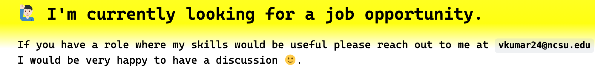
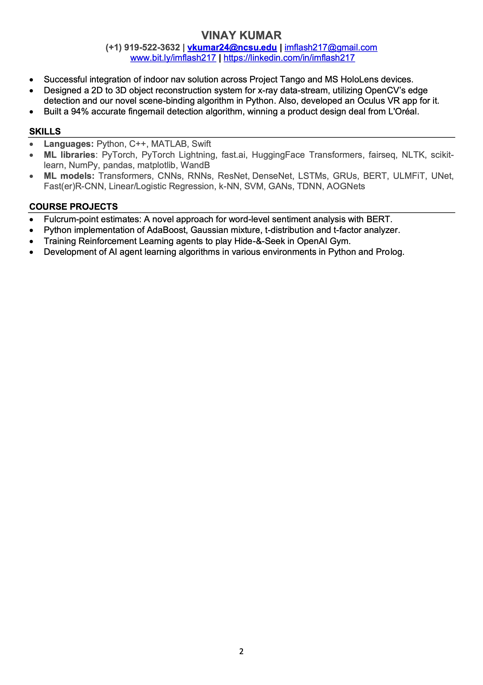

---
hide:
  - navigation # Hide navigation
  - toc        # Hide table of contents
---

<!-- [LinkedIn :material-linkedin:](#){: .md-button .md-button--primary }
[Github :material-github: ](#){: .md-button .md-button--primary } -->

<!-- ------------------------------------------------------------------------------------ -->

<!--
 -->

<!-- ------------------------------------------------------------------------------------ -->

  

    
  

  

    <h2><b>Vinay Kumar /  विनय कुमार </b></h2>
    <h3>Machine Learning Engineer</h3>
    
🎓 BTech in EE <a href="https://iith.ac.in/">@IIT-Hyderabad</a>

    
🎓 Masters in EE <a href="https://www.ncsu.edu/">@NC State University</a>

    
Find me on <a href="https://github.com/imflash217">GitHub</a>, <a href="https://linkedin.com/in/imflash217">LinkedIn</a> & <a href="https://wandb.ai/imflash217/">WandB</a> by the handle <b>@imflash217</b> or drop me an email at <b>vkumar24@ncsu.edu</b>

  

<!--

  <figure>
    
  </figure>

 -->
<!--

  
  

    <h2><b>Vinay Kumar /  विनय कुमार </b></h2>
    <h3>Machine Learning Engineer</h3>
    
🎓 BTech in EE <a style="font-weight:bold" href="https://iith.ac.in/">@IIT-Hyderabad</a>

    
🎓 Masters in EE <a style="font-weight:bold" href="https://www.ncsu.edu/">@NC State University</a>

    Find me on <a style="font-weight:bold" href="https://github.com/imflash217">GitHub</a>,
    <a style="font-weight:bold" href="https://linkedin.com/in/imflash217">LinkedIn</a> &
    <a style="font-weight:bold" href="https://wandb.ai/imflash217/">WandB</a> by the handle
    <b>@imflash217</b> or drop me an email at <b>vkumar24@ncsu.edu<b>
  

 -->

<!-- ------------------------------------------------------------------------------------ -->
<!--

<!-- 

<figure>
    
</figure>

 -->

<!-- 

<figure>
    
</figure>

 -->
